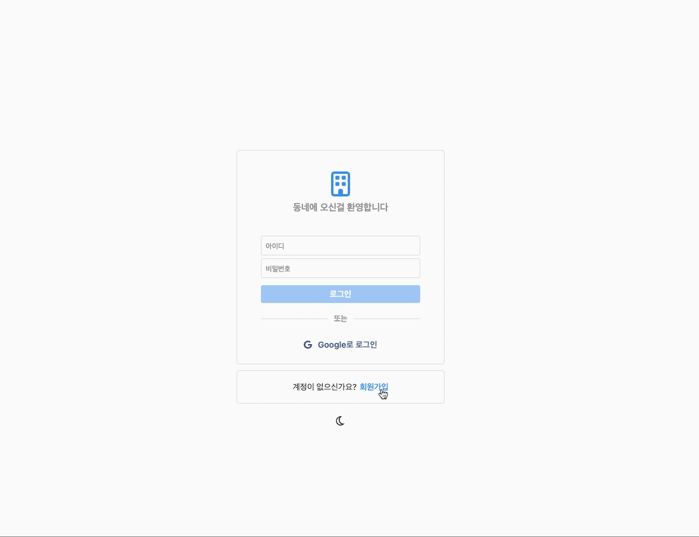
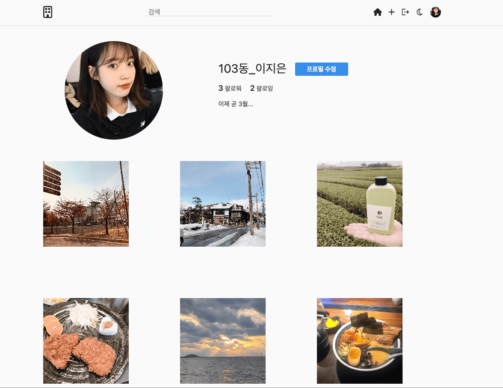
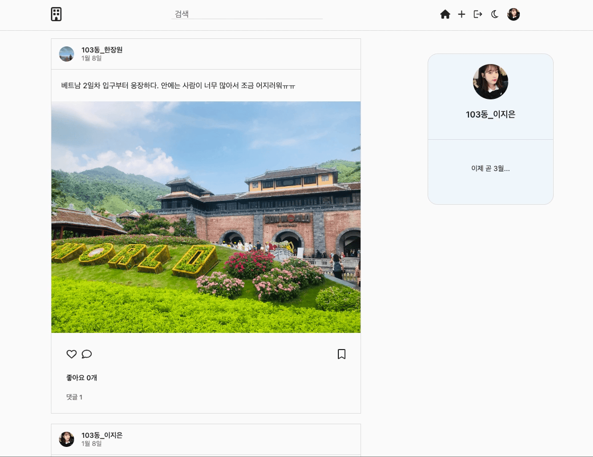
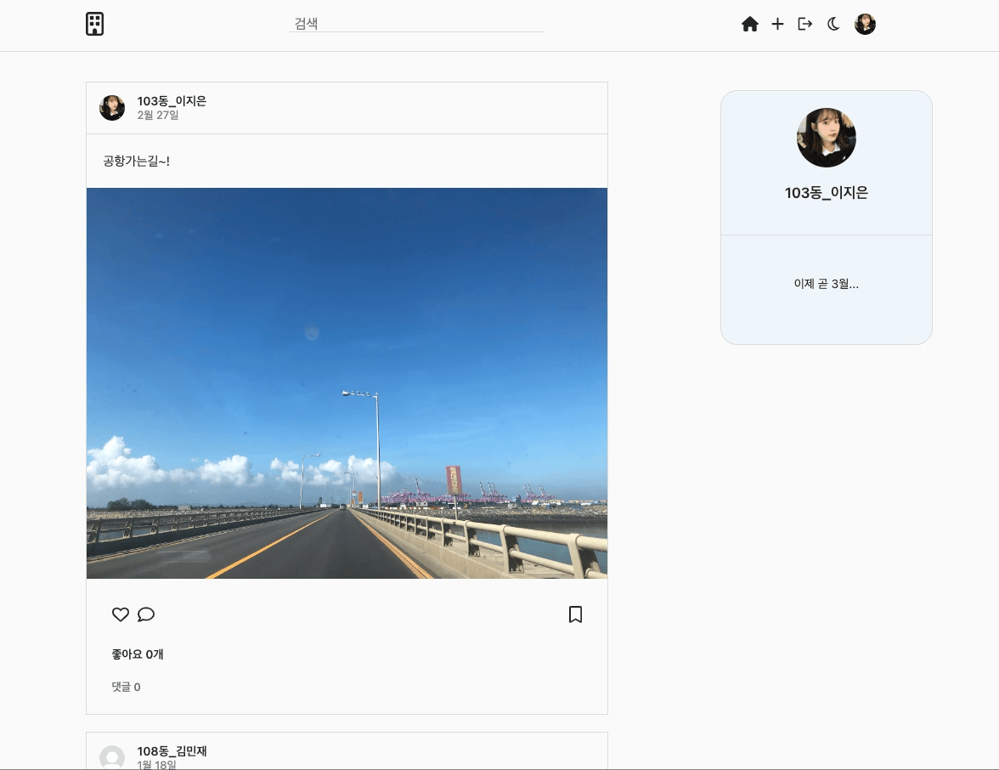

# DongNe

이사하면 떡을 돌리며 이웃들과 친하게 지냈던 예전과 달리 요즘에는 같은 아파트에 사는 주민들끼리 얼굴도 모르며 인사도 안 하게 되는 상황이 빈번하게 이뤄지고있다. 또한 맞벌이 가정과 혼자사는 사람들이 늘어나면서 아파트 관리사무소 공지를 제대로 받지 못 하는 경우도 허다하다.

DongNe는 같은 아파트에 거주하는 주민 사이의 소식을 공유함으로써 이웃간의 친밀감을 높이는 것이 DongNe의 첫 번째 목표이다.

---

  <a href="">
    
      
    
      
    
  </a>

## Table of contents

- 🔥 [Stack](#stack)
- 🌈 [Project](#project)
- 📑 [Pages](#pages)
- ⚙ [Features](#features)

## Stack

### Front-end

- `Typescript`
- `React`
- `Apollo Client`
- `GraphQL Code Generator`
- `Framer Motion`
- `Styled Components`

### Back-end

- `NodeJS`
- `Express`
- `PostgreSQL`
- `Apollo Server`
- `GraphQL`
- `Prisma`
- `JsonWebToken`

### App

- `React Native`
- `Expo`
- `Typescript`
- `Apollo Client`
- `React Navigation`
- `Styled Components`
- `GraphQL Code Generator`

### Deploy

- `Netlify`
- `Heroku`
- `AWS S3`

## Project

> 1. 회원가입, 로그인, 로그아웃

- 유저는 아이디, 비밀번호, 사용자 이름, 이메일을 입력해 회원가입을 할 수 있습니다.
- 회원가입 시, 비밀번호는 `Bcrypt`를 사용하여 해시화되며, 회원가입된 유저는 `PostgreSQL`에 저장됩니다.
- 유저는 아이디, 비밀번호를 입력하여 로그인할 수 있습니다.
- 로그인 시, `JsonWebToken`을 받고 해당 Token을 로컬 스토리지에 저장합니다.
- `Apollo Client3`의 새로운 기능인 `Reactive variables`를 사용하여 local state를 업데이트합니다.
- `Reactive variables`를 수정하게되면 해당 변수에 의존하는 모든 활성 쿼리의 업데이트가 자동으로 실행됩니다.
- 로그아웃 시, `Reactive variables`를 수정하고, 로컬 스토리지내에 저장된 Token과 스토어에 저장된 데이터를 제거합니다.
    
  

> 2. 프로필

- 프로필 페이지에서 유저 정보, 피드, 팔로우 등을 확인할 수 있습니다.
- 프로필 페이지가 로그인 된 유저의 프로필이면 프로필을 수정할 수 있습니다.
    
  

> 3. 유저 팔로우, 언팔로우

- 팔로우 버튼을 누르면 팔로우 및 언팔로우 할 수 있습니다.
- 팔로우 및 언팔로우를 하게되면, `Apollo Client`를 사용하여 팔로우 한 유저와 나의 캐시된 값을 직접 수정해줌으로써 팔로우와 팔로우 목록을 새로 업데이트합니다.
- 홈에서는 팔로우 한 유저가 업로드한 게시글만 볼 수 있습니다.
    
  

> 4. 사진

- 사진을 클릭하면 게시물의 정보를 확인할 수 있습니다.
- `Framer Motion`을 사용하여 모달 창에, 애니메이션을 적용하였습니다.
- 유저, 게시글, 좋아요, 댓글 등을 확인할 수 있습니다.
- 사진에 댓글을 작성할 수 있으며 본인 댓글은 삭제할 수 있습니다.
    
  

> 6. 게시물 업로드

- 사진과 글을 입력하여 게시물을 업로드할 수 있습니다.
- 사진은 `AWS S3 Bucket`에 저장됩니다.
- 게시물을 업로드하면 `Apollo Client`를 사용하여 게시물의 캐시된 값을 직접 수정하여 홈화면의 게시물들을 업데이트합니다.
    
  

> 7. 페이지네이션

- 모든 게시물을 한 번에 다 가져오게되면 응답시간이 느려질 수 있기 때문에 스크롤이 바닥에 닿았을 때마다 `Offset Pagination`을 사용하여 2개의 게시물을 추가로 가져올 수 있게 구현하였습니다.
    

> 8. 좋아요, 댓글

- 게시물에 좋아요를 클릭하면 좋아요할 수 있습니다. 한 번더 누르면 좋아요가 취소됩니다.
- 게시물에 댓글을 입력하면 입력한 댓글이 게시물에 추가됩니다.
- 로그인한 유저의 댓글만 삭제할 수 있습니다.
- 좋아요, 댓글 기능을 사용하면 `Apollo Client`를 사용하여 게시물의 캐시된 값을 직접 수정하여 해당 게시물의 좋아요와 좋아요 갯수, 댓글과 댓글 갯수를 업데이트합니다.
    
  

> 8. 다크모드

- 헤더에 위치한 달 아이콘을 클릭하여 다크 모드로 전환할 수 있습니다.
- `ThemeProvider`를 사용하여 라이트와 다크 모드를 설정합니다.
- 로컬 스토리지에 테마 활성 상태를 저장하고, `Reactive variables`를 사용하여 local state를 업데이트합니다.
    
  

> 9. 회원가입, 로그인, 로그아웃, 페이지네이션 (App)

- 아이디, 이름, 이메일, 비밀번호를 입력하여 회원가입 할 수 있습니다.
- 로그인 시 `AsyncStorage`에 token을 저장하고 `Reactive variables`를 사용하여 local state를 업데이트합니다.
- 로그아웃 시 `AsyncStorage`에 저장했던 `token`을 제거하고 `Reactive variables`의 상태를 변경합니다.
- 모든 게시물을 한 번에 다 가져오게되면 응답시간이 느려질 수 있기 때문에 스크롤이 바닥에 닿았을 때마다 `Offset Pagination`을 사용하여 2개의 게시물을 추가로 가져올 수 있게 구현하였습니다.
    
  
  

> 10. 사진 선택, 사진 촬영 (App)

- `expo-camera`를 이용하여 카메라에 접근하고 촬영할 수 있습니다.
- 촬영한 사진과 게시글을 작성하여 게시물을 업로드 할 수 있습니다.
- 촬영 버튼, 카메라 전환, 줌 슬라이더를 이용하여 카메라를 제어할 수 있습니다.
- `expo-media-library`를 이용하여 사용자의 미디어 라이브러리에 대한 엑세스를 제공합니다.
  
  
    

> 11. 채팅 (App)

- `GraphQL Subscriptions`를 이용하여 실시간 채팅을 할 수 있습니다.
- `Pubsub`을 통해 메세지를 보내면 이벤트를 publish하고, 이벤트를 listen하고 있는 유저는 메세지를 받게 됩니다.
  
    

## Pages

> Authentication

- 로그인
- 회원가입

> User

- 유저 프로필
- 프로필 수정
- 팔로잉
- 팔로워

> Post

- 홈
- 게시물 업로드
- 게시물 정보

## Features

### 🙎‍♂️ User

- [x] 로그인, 로그아웃
- [x] 회원가입
- [x] 프로필
- [x] 팔로우, 언팔로우
- [x] 팔로워, 팔로잉 보기
- [x] 프로필 수정

### 📷 Post

- [x] 게시물 보기
- [x] 게시물 업로드
- [x] 게시물 검색
- [x] 피드 보기

### 💬 Comment

- [x] 댓글 보기
- [x] 댓글 입력
- [x] 댓글 삭제

### ❤️ Like

- [x] 좋아요, 좋아요 취소

### ✉️ Message

- [x] 메세지 보내기
- [x] 메세지 읽기
- [x] 메세지 업데이트
